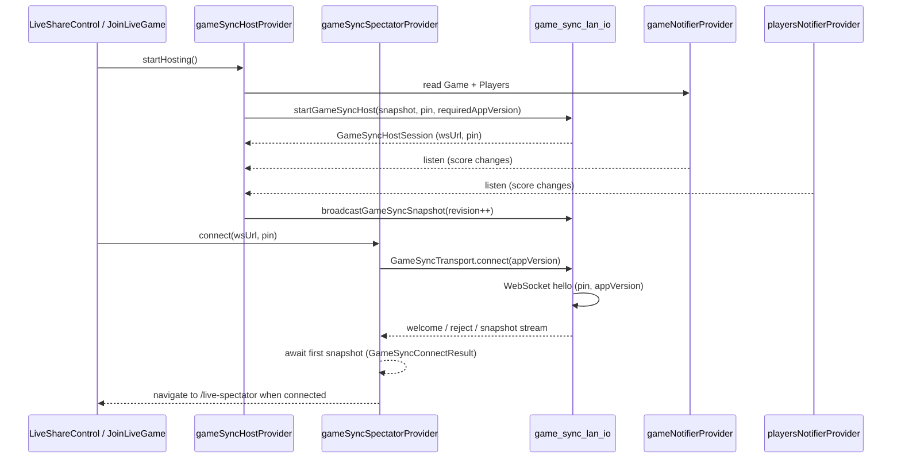

# Live game sync (LAN)

For transport options, platform scope, post-v1 roadmap, and the decision log, see [Live-Score-Sharing-Design.md](Live-Score-Sharing-Design.md).

View-only live score sharing over local Wi-Fi. The **host** device runs the real game (`gameNotifierProvider` / `playersNotifierProvider`); **spectators** mirror snapshots into `gameSyncSpectatorProvider` and render a read-only `ScoreTable`. Spectator state is **not** written to `SharedPreferences`.

v1 uses **mDNS (Bonsoir)** discovery and a **Shelf WebSocket** server on Android/iOS. Web/desktop hide host/join controls; CSV share is unchanged.

See also [State-Management.md](State-Management.md) for general Riverpod patterns.

---

## Architecture



| Layer | Role |
| --- | --- |
| **Providers** | Session UI state, wire listeners, map snapshots ↔ domain models |
| **`lib/sync/`** | Protocol, mapper, LAN I/O, QR URLs, platform gates |
| **`GameSyncTransport`** | Spectator connection abstraction (LAN v1; fake for tests) |

---

## Providers

### `gameSyncHostProvider` (`lib/provider/game_sync_host_provider.dart`)

**State:** `GameSyncHostState` — `isHosting`, `GameSyncHostSession?`, 6-digit `pin`, monotonic `revision`, optional `errorMessage`.

**Lifecycle:**

1. **`startHosting()`** — Reads current `gameNotifierProvider` and `playersNotifierProvider`, resolves app version via `resolveLiveSyncAppVersion(game)`, builds initial `GameSyncSnapshot` (revision `1`), calls `startGameSyncHost()` in `game_sync_lan_io.dart`.
2. If app version is unknown, sets `errorMessage: 'live_sync_app_version_unknown'` (localized in `LiveShareControl`).
3. On success, attaches `ref.listen` on game and players notifiers; any change calls **`broadcastCurrentState()`** (increments revision, `snapshotFromGame`, `broadcastGameSyncSnapshot`).
4. Snapshot **`hostDeviceName`** is set via `liveSyncConnectionLabel()` — short **game ID** prefix (preferred) or host **LAN IP** from `GameSyncHostSession.hostIp`. Do **not** use `Platform.localHostname` (often `localhost`).
5. **`stopHosting()`** — Closes listeners, `stopGameSyncHost()` (stops mDNS + WebSocket server).

**Stopped automatically when:** leaving score table (`score_table_screen`), or starting a new game (`new_game_control`).

**Does not** replace `gameNotifierProvider` / `playersNotifierProvider`; it only **reads** them and pushes wire snapshots.

### `gameSyncSpectatorProvider` (`lib/provider/game_sync_spectator_provider.dart`)

**State:** `GameSyncSpectatorState` — `connectionState`, mirrored `Game?` / `Players?`, `hostDeviceName`, `connectedHostIp`, `discoveredHosts`, `errorMessage`. **`isConnected`** requires `connected` plus non-null game and players (first **snapshot** received).

**Lifecycle:**

1. **`startDiscovery()` / `stopDiscovery()`** — mDNS browse; updates `discoveredHosts` (Bonsoir resolves `gameId` + `pin` from TXT).
2. **`connect(wsUrl, pin, …)`** → returns **`Future<GameSyncConnectResult>`**. Creates a **fresh** transport via `gameSyncTransportFactoryProvider()` (never reuses a disposed instance). Parses `connectedHostIp` from `wsUrl`. Subscribes to `connectionState` and `snapshots` streams. **Completes** when the first snapshot arrives (`connected`), a terminal error occurs, or after a **15s timeout** (`timedOut`).
3. **`connectToDiscovered(host)`** — Builds `ws://` URL from discovery record, then `connect`.
4. **`disconnect()`** — Releases transport (`_releaseTransport()`); resets state to idle.

**On connection failure:** `clearGame` for `idle`, `wrongPin`, `versionMismatch`, and `hostClosed` so stale scores are not shown.

**Does not** call `gameRepositoryProvider` or `playersRepositoryProvider`; mirrored models exist only in spectator state for `/live-spectator` and read-only score table mode.

### `gameSyncTransportFactoryProvider`

Returns `GameSyncTransport Function()` — `createLanGameSyncTransport` on mobile, `FakeGameSyncTransport.new` elsewhere. **`connect()` calls the factory for a new instance each time** so disposed stream controllers are never reused.

Override in tests:

```dart
gameSyncTransportFactoryProvider.overrideWith(
  (ref) => () => fakeTransport,
);
```

---

## Wire protocol (`lib/sync/game_sync_protocol.dart`)

JSON messages over WebSocket. Types: `hello`, `welcome`, `reject`, `snapshot`, `ping`, `pong`, `hostClosed`.

**`GameSyncSnapshot`** carries `protocolVersion`, `gameId`, `revision`, serialized `configuration`, `players` list, `hostDeviceName`, `status`. Mapped to/from `Game` + `Players` in `game_sync_mapper.dart`.

**Connection URL / QR:** `ws://<host-ip>:8765?game=<gameId>&pin=<pin>` (`game_sync_qr.dart`). mDNS service type: `_fsscore._tcp`.

---

## Handshake and validation

Admission runs on the **host** WebSocket handler (`_handleHostClient` in `game_sync_lan_io.dart`). Order matters:

1. **PIN** — Spectator `hello` must include a 6-digit PIN matching the host session (`isValidGameSyncPin` + equality with `_hostPin`). On failure: `reject` with `gameSyncRejectWrongPin` (`wrong_pin`), socket closed → spectator `GameSyncConnectionState.wrongPin`.

2. **App version** — Spectator `hello` includes `appVersion`. Host compares to `requiredAppVersion` set at `startGameSyncHost` using `gameSyncAppVersionsMatch(host, spectator)`. Both strings must be non-empty and share the same **major** semver segment (e.g. `1.12.0+236` matches `1.13.0+200`; `1.12.0` does not match `2.12.0`). On failure: `reject` with `gameSyncRejectVersionMismatch` (`version_mismatch`) → spectator `versionMismatch`.

3. **Welcome** — Host sends `welcome` with `appVersion: _hostRequiredAppVersion`, admits client, sends latest `snapshot` if available.

4. **Spectator double-check** — On `welcome`, transport re-runs `gameSyncAppVersionsMatch(spectatorAppVersion, message.appVersion)`. Mismatch disconnects with `versionMismatch` even if host admitted (defense in depth).

5. **Updates** — Host broadcasts `snapshot` on every game/players change and periodic ping (30s). Spectator maps each snapshot via `gameAndPlayersFromSnapshot`.

**Reject reasons** (`game_sync_protocol.dart`):

| Constant | Wire `reason` | UI state |
| --- | --- | --- |
| `gameSyncRejectWrongPin` | `wrong_pin` | `wrongPin` |
| `gameSyncRejectVersionMismatch` | `version_mismatch` | `versionMismatch` |

User-facing copy: `liveConnectionWrongPin`, `liveConnectionVersionMismatch`, `liveSyncAppVersionUnknown` (EN/ES in `lib/l10n/`).

---

## App version resolution

| Source | When |
| --- | --- |
| Global `appVersion` in `main.dart` | Set in `bootstrapApp()` from `PackageInfo` (`version+buildNumber`, e.g. `1.12.0+236`) |
| `GameConfiguration.version` | Fallback when global is null (tests, edge startup) |

**Helper:** `resolveLiveSyncAppVersion(game)` in `lib/sync/game_sync_app_version.dart` — prefers package info, then persisted config version.

**Host:** Must resolve version before `startGameSyncHost`; passes `requiredAppVersion` into LAN layer.

**Spectator:** Sends same resolved string in `hello`; validates host version in `welcome`.

This is the **app build version**, not `GameConfiguration` schema version alone. Both sides must run the same **major** FS Score Card release for compatible snapshot JSON (minor/patch/build may differ).

---

## Connection banner labels

Spectator **`LiveConnectionBanner`** must not show device hostnames like `localhost`.

**Resolution** (`lib/sync/game_sync_connection_label.dart`):

1. Prefer **short game ID** (first 8 characters of `spectator.game?.gameId`).
2. Else **LAN IPv4** from `connectedHostIp` (parsed from the join `wsUrl`) or from snapshot `hostDeviceName` when it is a valid IPv4.
3. Else **`liveConnectionConnectedOnly`** (“Connected”) — never fall back to `localhost` or `liveSpectatorTitle`.

**Host snapshots** set `hostDeviceName` via `liveSyncConnectionLabel(gameId:, hostIp:)` in `gameSyncHostProvider` so wire data matches banner logic.

---

## Join UI behavior

| Flow | Behavior |
| --- | --- |
| QR scan | `_JoinLiveScanDialog` uses one-shot detection (`DetectionSpeed.noDuplicates`, `_handled` flag) — multiple `Navigator.pop` calls break GoRouter |
| Connect | “Connecting…” overlay; **awaits** `GameSyncConnectResult` before navigating to `/live-spectator` |
| Errors | Snackbars for `wrongPin`, `versionMismatch`, `cannotReachHost`, `timedOut`, `failed` |
| Host dialog | `LiveShareControl` AlertDialog title row includes **`CloseButton`** (dismisses dialog only; sharing continues until **Stop live sharing**) |

---

## Debug logging

Assert-wrapped logs (stripped in release) in `lib/sync/game_sync_log.dart`:

- `gameSyncLog()` — general messages
- `gameSyncLogConnectionState()` — `previous -> next` connection state transitions

Logged from join screen (QR URL, connect results), `GameSyncSpectatorNotifier`, and `LanWsGameSyncTransport` / `FakeGameSyncTransport`. Filter DevTools by `GameSync`, `GameSyncConnection`, `JoinLiveGameScreen`, or `GameSyncSpectatorNotifier`.

---

## UI and routing

| Screen / control | Provider |
| --- | --- |
| `LiveShareControl` (in-game app bar) | `gameSyncHostProvider` |
| `JoinLiveGameScreen` (`/join-live`) | `gameSyncSpectatorProvider` discovery + connect |
| `SpectatorScoreTableScreen` (`/live-spectator`) | `gameSyncSpectatorProvider` |
| `LiveConnectionBanner` | `connectionState`, `gameId`, `connectedHostIp`; label via `resolveLiveConnectionBannerTarget` |
| `ScoreTable` (`readOnly`) | Can watch spectator state when spectating |

Platform gates: `canHostLiveSync` / `canJoinLiveSync` in `game_sync_platform.dart` (mobile native only in v1).

---

## Testing

| Area | Approach |
| --- | --- |
| Protocol / version / QR / mapper / connection labels | Unit tests in `test/game_sync_*.dart` |
| Widget / provider tests | Override `gameSyncTransportFactoryProvider` with `() => FakeGameSyncTransport`; set `pinAccepted`, `appVersionAccepted`, `expectedHostAppVersion` |
| E2E LAN + mDNS | Two physical devices, same Wi-Fi; emulators use manual `ws://` URL (`kDebugMode` on join screen) |

**Do not** persist spectator snapshots to prefs. **Do not** write scores through spectator providers into host notifiers.

---

## Key files

- `lib/provider/game_sync_host_provider.dart`
- `lib/provider/game_sync_spectator_provider.dart`
- `lib/sync/game_sync_protocol.dart`
- `lib/sync/game_sync_mapper.dart`
- `lib/sync/game_sync_app_version.dart`
- `lib/sync/game_sync_connection_label.dart`
- `lib/sync/game_sync_log.dart`
- `lib/sync/game_sync_lan_io.dart` / `game_sync_lan_stub.dart`
- `lib/sync/game_sync_transport.dart`
- `lib/sync/fake_game_sync_transport.dart`
- `lib/presentation/live_share_control.dart`
- `lib/presentation/join_live_game_screen.dart`
- `lib/presentation/live_connection_banner.dart`
