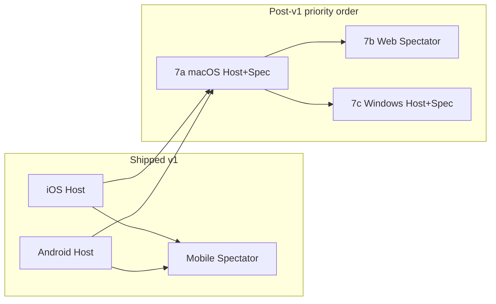

# Live score sharing — design and decisions

Serverless, view-only live score sharing for FS Score Card: the **host** edits scores on one device; **spectators** mirror snapshots over the local network. v1 assumes all participants are on the **same Wi‑Fi or subnet** and ships on **Android and iOS** only.

For protocol, providers, handshake, and testing, see [Game-Sync.md](Game-Sync.md). For Riverpod and persistence patterns, see [State-Management.md](State-Management.md).

---

## Overview

| Aspect           | Selection                                                           |
| ---------------- | ------------------------------------------------------------------- |
| Backend          | **None** — no session server, Firebase, or custom relay you operate |
| Interaction (v1) | **View-only** — host writes; spectators read live snapshots         |
| Network (v1)     | **Same LAN** — home Wi‑Fi, venue hotspot, phone hotspot             |
| Transport (v1)   | **Option A** — Bonsoir mDNS + Shelf WebSocket (`ws://`)             |
| Platforms (v1)   | **Android + iOS** — host and spectator                              |
| Cross-network    | **Deferred** — Option D (WebRTC) documented as future upgrade       |

Sync payload and Riverpod wiring stay **transport-agnostic** (`GameSyncTransport` abstraction).

---

## Selected decisions (summary)

| Decision                | Selected                                              | Change how                                                          |
| ----------------------- | ----------------------------------------------------- | ------------------------------------------------------------------- |
| Interaction model       | **V1 view-only**                                      | Collaborative edits in a future phase                               |
| Network assumption      | **Same Wi‑Fi or subnet**                              | Cross-network → Option D                                            |
| Transport / discovery   | **Option A** — mDNS (`bonsoir`) + WebSocket (`shelf`) | Swap transport impl to Option D                                     |
| Live P2P platforms (v1) | **Android and iOS**                                   | Post-v1: **macOS (7a)** → **web spectator (7b)** → **Windows (7c)** |

### Option A implementation choices (v1)

| Piece             | Choice                                                                          |
| ----------------- | ------------------------------------------------------------------------------- |
| Primary transport | LAN **WebSocket** (`ws://`) with JSON messages                                  |
| Discovery         | **bonsoir** mDNS (`_fsscore._tcp`) + **connection QR** + manual IP/PIN fallback |
| Security (v1)     | **6-digit PIN** + **app major version** match; trust LAN participants           |
| Authority         | Host-only writes; spectators do not persist wire state                          |
| Cross-network     | Out of scope v1                                                                 |

**Admission:** Spectator `hello` sends PIN and `appVersion`. Host and spectator both use `gameSyncAppVersionsMatch()` — non-empty strings must share the same **major** semver segment (e.g. `1.12.0+236` matches `1.13.0+200`; `1.12.0` does not match `2.12.0`). Details: [Game-Sync.md — Handshake and validation](Game-Sync.md#handshake-and-validation).

**Pairing flow:**

1. Host taps **Live share** → mDNS + WebSocket → connection QR + PIN.
2. Spectator **Join live game** → mDNS list, QR scan, or debug/manual `ws://` URL → `hello`.
3. Host `welcome` / `reject` → `snapshot` on each score change.
4. Spectator `connect()` returns `GameSyncConnectResult` after first snapshot (or terminal error / 15s timeout).

---

## Options considered

All options avoid a **central server you operate**. v1 ships **Option A** only.

| ID    | Option                   | Discovery               | Transport              | Cross-network? | Host v1      | Spectator v1 | Your backend? | Complexity  | Status                                  |
| ----- | ------------------------ | ----------------------- | ---------------------- | -------------- | ------------ | ------------ | ------------- | ----------- | --------------------------------------- |
| **A** | **LAN mDNS + WebSocket** | Bonsoir `_fsscore._tcp` | `ws://` JSON           | No             | Android, iOS | Android, iOS | None          | Medium      | **Selected — shipped (v1)**             |
| **D** | WebRTC data channels     | QR / paste SDP + ICE    | Encrypted data channel | Yes            | —            | —            | None*         | High        | **Future** — cross-network              |
| B     | LAN subnet scan + WS     | IP scan                 | `ws://`                | No             | Fallback     | Fallback     | None          | Medium      | Not selected — mDNS blocked, same LAN   |
| C     | UDP multicast            | Multicast group         | UDP + TCP              | No             | —            | —            | None          | Medium–high | Not selected                            |
| E     | Nearby / Multipeer       | OS APIs                 | OS-specific            | Mostly no      | —            | —            | None          | High        | Not selected                            |
| F     | Wi‑Fi Direct             | P2P group               | Sockets                | No             | —            | —            | None          | High        | Not selected                            |
| G     | Bluetooth LE             | BLE                     | GATT                   | No             | —            | —            | None          | High        | Not selected                            |
| H     | HTTP snapshot poll       | mDNS / QR               | HTTP poll              | No             | Alt          | Alt          | None          | Low–medium  | Not selected                            |
| I     | CSV / share sheet        | N/A                     | Text                   | N/A            | N/A          | N/A          | —             | —           | **Shipped** — one-shot export, not live |

\* Public STUN/TURN are third-party dependencies, not your backend — relevant only for Option D.

### Option A — LAN mDNS + WebSocket (selected)

- Host: bonsoir `_fsscore._tcp`; Shelf WebSocket in `lib/sync/game_sync_lan_io.dart`.
- Discovery: mDNS browse list, connection QR (`game_sync_qr.dart`), manual `ws://` + PIN (debug / fallback).
- Same JSON schema regardless of future transport.

### Option D — WebRTC (not selected for v1)

- `lib/sync/game_sync_transport_webrtc.dart` is a **stub**; no `flutter_webrtc` until a cross-network phase.
- Would reuse the same snapshot/message types over a data channel.

### Option I — CSV (complementary)

- [`ShareGameControl`](../lib/presentation/share_game_control.dart) on all platforms; unchanged by live sync.

### “No backend” — v1 (Option A)

| Allowed                                          | Not allowed                                                |
| ------------------------------------------------ | ---------------------------------------------------------- |
| Device-to-device traffic on the local network    | Your session server, Firebase, custom REST/WebSocket relay |
| mDNS/Bonjour (`bonsoir`)                         | Cloud game state                                           |
| Connection QR (`ws://host:port?game=id&pin=pin`) | Public STUN/TURN (not needed on LAN)                       |
| Manual host IP + PIN when mDNS fails             |                                                            |

### “No backend” — future Option D only

| Allowed                                    | Not allowed                       |
| ------------------------------------------ | --------------------------------- |
| QR / copy-paste signaling between peers    | Your own relay you operate        |
| Public STUN (e.g. Google/Mozilla)          | Mandatory hosted TURN you operate |
| Optional user-entered TURN URL/credentials | Cloud game state                  |

### Out of scope for v1 (same LAN assumption)

- Host on cellular while spectators are on a different network.
- Guest Wi‑Fi with **client isolation** (devices cannot reach each other).
- Remote viewers without joining the host LAN.

---

## Platform scope

FS Score Card is one Flutter codebase for Android, iOS, **web** (GitHub Pages), Windows, and macOS.

| Platform    | App ships? | Live P2P            | Host complexity | Spectator complexity | Role                                |
| ----------- | ---------- | ------------------- | --------------- | -------------------- | ----------------------------------- |
| **Android** | Yes        | **v1 shipped**      | Low (done)      | Low (done)           | Host or spectator                   |
| **iOS**     | Yes        | **v1 shipped**      | Low (done)      | Low (done)           | Host or spectator                   |
| **macOS**   | Yes        | **Phase 7a** (next) | Medium          | Low–Medium           | Full host + spectator               |
| **Web**     | Yes        | **Phase 7b**        | None            | Medium–High          | Read-only spectator via `ws://` URL |
| **Windows** | Yes        | **Phase 7c**        | Medium–High     | Medium               | Host + spectator after 7a/7b        |
| Linux       | Present    | Not planned         | —               | —                    | Same as other desktop               |

**v1 product rule (mobile only)**

- **Host:** Android or iOS — Live share → mDNS + WebSocket → QR + PIN.
- **Spectator:** Android or iOS — Join via mDNS, QR, or manual URL.
- **Web / macOS / Windows (v1):** No Live / Join; CSV + local play only.

**Implementation gates** (`lib/sync/game_sync_platform.dart`):

- v1: `canHostLiveSync` / `canJoinLiveSync` true only on Android/iOS.
- **7a:** add macOS to both.
- **7b:** add web to `canJoinLiveSync` only.
- **7c:** add Windows to both.

---

## Platform complexity (same Wi-Fi)

Ratings for enabling **Option A** on additional targets. Assumption: **same Wi‑Fi/subnet**; no WebRTC/STUN/TURN. Host and spectator rated separately.

**Post-v1 priority:** **macOS (7a)** → **web spectator (7b)** → **Windows (7c)**. macOS reuses `dart:io` + Bonsoir with the lowest incremental effort before browser mixed-content and Windows firewall work.

### Rating scale

| Rating          | Meaning                                     | Typical effort    |
| --------------- | ------------------------------------------- | ----------------- |
| **None**        | Not feasible without different architecture | —                 |
| **Low**         | Mostly platform gates + QA; reuse LAN I/O   | ~1–2 days         |
| **Medium**      | Entitlements + UI tweaks + manual QA        | ~3–5 days         |
| **Medium–High** | Transport split, browser security, firewall | ~1–2 weeks        |
| **High**        | Major new surface or platform-blocked       | 2+ weeks or defer |

### Complexity matrix

| Platform    | Host            | Spectator       | Priority        | Rationale (same Wi-Fi)                                                                                                                                                                                                                                                                                                                                                       |
| ----------- | --------------- | --------------- | --------------- | ---------------------------------------------------------------------------------------------------------------------------------------------------------------------------------------------------------------------------------------------------------------------------------------------------------------------------------------------------------------------------- |
| **macOS**   | **Medium**      | **Low–Medium**  | **7a (first)**  | `game_sync_lan_io.dart` uses `dart:io` + Bonsoir (`bonsoir_darwin`). Host: extend `canHostLiveSync`; Release entitlements (`network.server`); Bonjour/local-network strings; firewall QA. Spectator: extend `canJoinLiveSync`; reuse join/spectator screens; QR via `mobile_scanner` or manual URL.                                                                          |
| **Web**     | **None**        | **Medium–High** | **7b (second)** | No Shelf/`HttpServer` or Bonsoir host on web (`game_sync_lan_stub.dart`). Spectator needs browser WS client split from IO transport. Join: paste `ws://` URL (no mDNS). **Blocker:** GitHub Pages is **HTTPS** — browsers block `ws://` from secure pages (mixed content). Local HTTP dev may work; production may need `wss://`, HTTP-only build, or documented workaround. |
| **Windows** | **Medium–High** | **Medium**      | **7c (third)**  | Same IO stack as macOS (`bonsoir_windows`). Host: platform gate + Windows Defender inbound firewall UX. Spectator: mDNS less reliable on some networks; manual URL fallback exists. More QA than macOS; benefits from 7a patterns.                                                                                                                                           |

### What already exists (reduces post-v1 effort)

- Protocol, providers, spectator UI: `gameSyncSpectatorProvider`, `SpectatorScoreTableScreen`, `JoinLiveGameScreen`
- Connection URL + QR: `game_sync_qr.dart`
- PIN + major app version handshake
- Manual URL path on join screen (web needs always-visible URL field)

---

## Post-v1 delivery

| Phase      | Scope                                           | Complexity           | Status                            |
| ---------- | ----------------------------------------------- | -------------------- | --------------------------------- |
| **7a**     | macOS host + spectator                          | Medium + Low–Medium  | Pending (priority)                |
| **7b**     | Web read-only spectator (`ws://` URL, same LAN) | Medium–High          | Pending                           |
| **7c**     | Windows host + spectator                        | Medium–High + Medium | Pending                           |
| **Future** | Option D — WebRTC cross-network                 | High                 | Pending                           |
| **Future** | HTTPS web spectator (`wss://` on host)          | High                 | After 7b if GitHub Pages required |

### Phase 7a — macOS (first)

1. Extend `canHostLiveSync` and `canJoinLiveSync` for `TargetPlatform.macOS`.
2. Release entitlements (`network.server`, likely `network.client`); Info.plist local network usage if prompted.
3. Reuse `LiveShareControl`, `JoinLiveGameScreen`, `SpectatorScoreTableScreen`.
4. Bonsoir + Shelf QA on macOS hardware.

### Phase 7b — web spectator

1. Split `LanWsGameSyncTransport` into e.g. `game_sync_lan_web.dart`; update `game_sync_lan.dart` export chain (`io` / `html` / `stub`).
2. `canJoinLiveSync` true on web; `canHostLiveSync` false.
3. Join UI: hide mDNS; paste URL + PIN; mixed-content errors in l10n.
4. Product decision: HTTP-only local build vs `wss://` on host.

**Web host (None)** — no in-browser WebSocket server without native companion, extension, or backend.

### Phase 7c — Windows

1. Extend `canHostLiveSync` and `canJoinLiveSync` for `TargetPlatform.windows`.
2. Windows Defender firewall guidance in docs.
3. Bonsoir reliability testing; emphasize manual `ws://` on corporate networks.
4. Apply macOS 7a entitlement and QA lessons.

---

## Future paths

### Option D — cross-network (WebRTC)

When product requires different networks (cellular host, remote spectator without shared LAN):

- Implement `GameSyncTransport` over WebRTC data channels; same JSON snapshot schema.
- Discovery via QR / paste SDP + ICE; public STUN allowed; optional user TURN.
- Update [PRIVACY_POLICY.md](../PRIVACY_POLICY.md) for STUN/TURN disclosure.

### HTTPS web spectator (`wss://`)

If production web spectator must work on GitHub Pages (HTTPS), host may need **WSS** — touches mobile host server and certificate strategy. Defer until after 7b unless product mandates earlier.

### After phase 7c

- Collaborative multi-writer sync (conflict rules TBD).
- Web host remains **None** without new architecture.

---

## Implementation status

**v1 (Option A, Android/iOS view-only) — implemented in repo.** Operational detail: [Game-Sync.md](Game-Sync.md). Skill: `.agents/skills/fs-game-score-live-sync/SKILL.md`.

| Area                          | Status | Notes                                                                                         |
| ----------------------------- | ------ | --------------------------------------------------------------------------------------------- |
| Protocol + LAN transport      | Done   | `lib/sync/*`; WebRTC stub only                                                                |
| Host / spectator providers    | Done   | Fresh `GameSyncTransport` per `connect()`                                                     |
| Admission                     | Done   | PIN + major app version                                                                       |
| UI                            | Done   | `LiveShareControl`, `JoinLiveGameScreen`, `SpectatorScoreTableScreen`, `LiveConnectionBanner` |
| Platform                      | Done   | Mobile host/join; web/desktop gated; CSV unchanged                                            |
| Unit tests                    | Done   | `test/game_sync_*.dart`                                                                       |
| Widget tests (mock transport) | Open   | Pattern in Game-Sync.md                                                                       |
| Physical-device LAN QA        | Open   | Manual ship gate (two phones, same AP)                                                        |
| Phase 7a macOS                | Open   | Priority                                                                                      |
| Phase 7b web spectator        | Open   | `canJoinLiveSync` false on web today                                                          |
| Phase 7c Windows              | Open   | After 7a/7b                                                                                   |

**v1 ship gate (manual):** physical-device matrix on two phones, same access point — mDNS, QR, manual IP, wrong PIN, host stop, client isolation, version mismatch.

**Related improvements** (landed with live sync, not original P2P scope):

- Splash player clear race — `prepareForSplashEntry()`, coalesced persist — [State-Management.md#splash-entry-and-coalesced-persist-race](State-Management.md#splash-entry-and-coalesced-persist-race)
- Integration helpers — `waitForSplashReady()`, `waitForScoreTable()` — see testing skill / `integration_test/app_test_helpers.dart`

---

## Decision log

| Date           | Transport             | Platforms                           | Notes                                         |
| -------------- | --------------------- | ----------------------------------- | --------------------------------------------- |
| Initial        | A mDNS + WS           | Same Wi‑Fi; Android/iOS v1          | Aligned with problem statement                |
| Superseded     | D + opt A             | Cross-network default               | Reverted — exceeded v1 scope                  |
| **Current v1** | **A mDNS + WS**       | **Android, iOS**; view-only         | Same LAN; no STUN/WebRTC                      |
| 2026-05-23     | A implemented         | Mobile host/join in repo            | PIN + major app version; Game-Sync.md         |
| 2026-05-23     | Complexity rated      | Web/macOS/Windows host vs spectator | Phases 7a/7b/7c                               |
| 2026-05-23     | Phase priority        | **macOS → web → Windows**           | 7a full desktop; 7b web spectator; 7c Windows |
| Planned 7a     | A (desktop)           | + macOS host + spectator            | Same LAN                                      |
| Planned 7b     | A (`ws://` URL)       | + web read-only spectator           | Browser WebSocket; mixed-content TBD          |
| Planned 7c     | A (desktop)           | + Windows host + spectator          | After macOS patterns                          |
| Planned future | D WebRTC + optional A | Mobile (+ web if needed)            | Cross-network when required                   |

---

## Related docs and code

| Topic                  | Location                                                                                     |
| ---------------------- | -------------------------------------------------------------------------------------------- |
| Implementation guide   | [Game-Sync.md](Game-Sync.md)                                                                 |
| State / splash race    | [State-Management.md](State-Management.md)                                                   |
| Privacy (LAN sessions) | [PRIVACY_POLICY.md](../PRIVACY_POLICY.md)                                                    |
| Sync layer             | `lib/sync/` — protocol, mapper, LAN I/O, QR, platform gates                                  |
| Providers              | `lib/provider/game_sync_host_provider.dart`, `game_sync_spectator_provider.dart`             |
| UI                     | `live_share_control.dart`, `join_live_game_screen.dart`, `spectator_score_table_screen.dart` |
| Agent skill            | `.agents/skills/fs-game-score-live-sync/SKILL.md`                                            |

Wire protocol and message types: `lib/sync/game_sync_protocol.dart` (documented in [Game-Sync.md](Game-Sync.md)).
