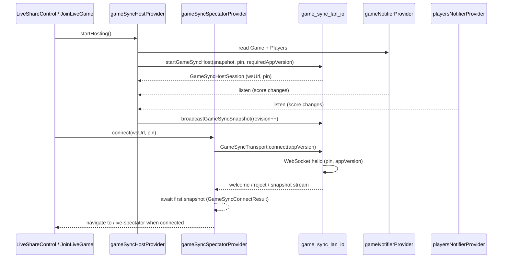

# Live sync — architecture and design intent

Why LAN live sync is shaped the way it is. For the concrete provider APIs, wire protocol, handshake, and testing, see **[Game-Sync.md](Game-Sync.md)**. For transport options and the decision log, see [Live-Score-Sharing-Design.md](Live-Score-Sharing-Design.md).

## The core idea

Live sharing is **view-only** and **serverless**. One device — the **host** — runs the real game in the normal `gameNotifierProvider` / `playersNotifierProvider`. Other devices — **spectators** — mirror read-only snapshots and render a read-only `ScoreTable`.

The guiding constraint: **the host is the single source of truth**. Spectators never write scores back, and spectator state is deliberately **not** persisted to `SharedPreferences` — a mirror should never outlive or contaminate the real game on that device.

## Why this layering

| Layer                   | Role                                                            | Why it exists                                                     |
| ----------------------- | --------------------------------------------------------------- | ----------------------------------------------------------------- |
| **Providers**           | Session UI state, wire listeners, map snapshots ↔ domain models | Keeps sync session state out of the authoritative game providers  |
| **`lib/sync/`**         | Protocol, mapper, LAN I/O, QR URLs, platform gates              | Transport-agnostic core so the LAN transport can be swapped later |
| **`GameSyncTransport`** | Spectator connection abstraction (LAN v1; fake for tests)       | Lets widget tests run without a real network                      |

Host and spectator **do not** share a single notifier. The host owns authoritative state in the normal game providers; the spectator only reflects wire snapshots. Keeping the transport behind `GameSyncTransport` and the payload transport-agnostic is what makes the post-v1 upgrade path (e.g. WebRTC) possible without touching provider or UI code.
