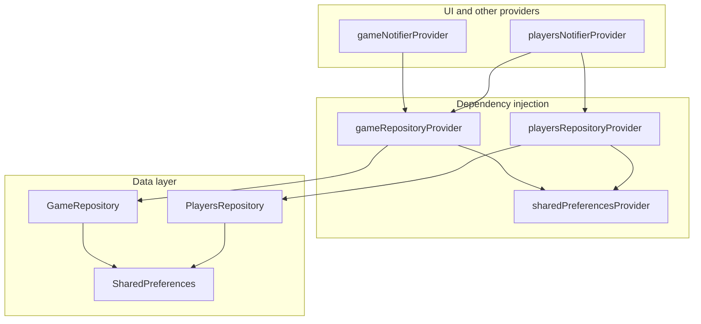

# State Management Documentation

## Retaining and Managing State

The application saves the game configuration when the game is started and the current game state while the game is being played. There is currently a 3-second delay (debounce) for saving the game state to disk to prevent excessive writes (`kPlayersSaveDebounceDuration` in `players_provider.dart`).

### Upon Startup

- **No game state to restore**: It loads the persisted game configuration and makes it the active configuration when the game is launched, showing it on the **Splash Screen**.
- **Game state to restore exists**: The active game is loaded, and the application navigates directly to the `score_table_screen`. This enables seamless game resumption after an app crash, a browser reload on the web, or a pause/dehydration event on mobile.

The "New Game" function on the Splash Screen clears out any previous game state whenever a new game is started.

Currently, there is no way to clear the game configuration or game state other than to configure and start a new game.

## Known Issues and Defects

None currently tracked for startup persistence. Player roster state is saved immediately when the user taps **Start new game** on the Splash Screen (see [New Game Flow](#new-game-flow-libpresentationsplash_screendart)).

## Data Model

A game is represented by the `Game` class that contains a game `id` (automatically generated as a UUID) and a game `configuration` implemented by the `GameConfiguration` class. The `GameConfiguration` contains the number of players, the maximum number of rounds, the game mode (`Standard`, `Phase 10`, `French Driving`, `Skyjo`), the score filter, the end game score, and the version.

The players and their scores in a game are represented by the `Players` class, which wraps a list of `Player` objects.

Each player is represented by a `Player` object that contains:

- `name`: The player's display name.
- `scores`: A `Scores` object containing individual round scores.
- `phases`: A `Phases` object tracking phase completion status.
- `frenchDrivingAttributes`: A list of `FrenchDrivingRoundAttributes` (for the French Driving game mode).
- `roundStates`: A `RoundStates` object representing per-round information (such as round column locks that tell the UI to block editing for that round).

---

## State Management

This application uses **Riverpod 3** (via `flutter_riverpod` and `hooks_riverpod` version `^3.1.0`) as its state management solution. Riverpod provides compile-time safety, unidirectional data flow, and powerful reactive programming capabilities. The architecture uses `Notifier` and `NotifierProvider` to manage and modify synchronous application state.

### Features Include

- **Separation of Concerns**: Game configuration and player data use separate notifier providers (`gameNotifierProvider`, `playersNotifierProvider`) and repository providers (`gameRepositoryProvider`, `playersRepositoryProvider`) for persistence.
- **Reactive UI**: The UI widgets automatically watch and rebuild in real-time when the state changes.
- **Persistence**: Game configuration and Player progress are persisted locally using `SharedPreferences`, enabling app restart recovery ("Resume Game").

### Core Concepts

- **Notifier**: A class extending `Notifier<T>` that encapsulates business logic and manages state of type `T`.
- **NotifierProvider**: Declares a provider that exposes and manages a `Notifier` instance.
- **ref.watch()**: Subscribes a widget or another provider to state changes, triggering a rebuild when the state updates.
- **ref.read()**: Reads the current state or triggers actions inside a notifier without subscribing to future updates (typically used in event handlers like buttons).

---

## Riverpod Usage Guidelines

Follow these rules when adding features or fixing bugs. See [Provider Architecture](#provider-architecture) for repository vs notifier comparisons.

### Provider layers (top to bottom)

| Provider | Responsibility |
| -------- | -------------- |
| `sharedPreferencesProvider` | Injects the single `SharedPreferences` instance (must be overridden in `bootstrapApp`) |
| `gameRepositoryProvider` / `playersRepositoryProvider` | Stateless persistence services (`load*`, `save*`, `clear*`) |
| `gameNotifierProvider` / `playersNotifierProvider` | In-memory app state (`Game`, `Players`) and gameplay mutations |
| `appRouterProvider` | `GoRouter` wired to prefs for initial route |
| UI (`ConsumerWidget`) | `ref.watch` notifier providers; never own persistence logic |

### `ref.watch` vs `ref.read`

- **`ref.watch`**: Use in widget `build()` methods and in other providers' `build()` when the consumer must rebuild when dependencies change.
- **`ref.read`**: Use in callbacks (`onPressed`, `initState` one-shot setup), notifier mutation methods, and when calling `.notifier` to run an action without subscribing.
- **Do not** call `ref.watch` inside event handlers; it does not subscribe the widget and is misleading.

### UI and notifier rules

- Widgets should use **`gameNotifierProvider`** and **`playersNotifierProvider`** for display and actions (`ref.read(...notifier).updateScore(...)`).
- Do **not** call `GameRepository` / `PlayersRepository` from widgets except documented exceptions:
  - Splash: `playersNotifierProvider.notifier.prepareForSplashEntry()` on entry (via `SplashScreen`; see [Splash entry and debounced-save race](#splash-entry-and-debounced-save-race))
  - Router: `initialLocation()` reads repos before the widget tree exists (see below)
- Do **not** push loaded state from repositories into notifiers via side channels; restore in `Notifier.build()` only.

### `Notifier.build()` rules

- Load synchronously from the matching repository provider (`ref.watch(gameRepositoryProvider)` then `loadGame()`).
- Return persisted data when validation passes (`playersMatchConfiguration` for players).
- **No** saves, timers, or `unawaited` disk writes in `build()` — those belong in mutation methods or explicit UI flows (e.g. splash **Start new game** saving the baseline roster).

### Mutations and persistence

1. Update `state` on the notifier.
2. Persist with `ref.read(gameRepositoryProvider).saveGame(state)` or `playersRepositoryProvider` (often debounced for players).

### Startup and `UncontrolledProviderScope`

`bootstrapApp()` in `lib/main.dart`:

1. Awaits `SharedPreferences.getInstance()` before `runApp`.
2. Creates a `ProviderContainer` with `sharedPreferencesProvider.overrideWithValue(sharedPrefs)`.
3. Mounts the tree with **`UncontrolledProviderScope`** so the container created in `main` is the app's provider scope (the framework does not create a separate container).

Notifiers load persisted data the first time something `watch`es or `read`s them — there is no imperative `repositoryDidLoadPrefs()`.

### Anti-patterns (do not reintroduce)

| Anti-pattern | Why it fails |
| ------------ | ------------ |
| Singleton `GameRepository()` / `PlayersRepository()` | Untestable, hides DI, duplicate prefs instances |
| `repositoryDidLoadPrefs()` on notifiers | Bypasses `build()` validation; caused restore bugs |
| Resume routing via `prefs.containsKey` only | Routes to score table when JSON is invalid or mismatched |
| `phases.completedPhases.length == numPhases` | Wrong dimension; phases lists are sized by `maxRounds` |
| Fire-and-forget `main()` in integration tests | Races `runApp` on slow Android devices |

### Integration and widget testing

**Unit / widget tests** (`test/`):

- `test/flutter_test_config.dart` sets `SharedPreferences.setMockInitialValues({})` before each run.
- Widget tests that need repositories should wrap the widget in `ProviderScope` and override `sharedPreferencesProvider` with the same mock instance.

**Integration tests** (`integration_test/`):

- Use helpers in `integration_test/app_test_helpers.dart`:
  - `clearPersistedGameState()` in `setUp` / `tearDown` (real prefs on devices)
  - `await launchApp(tester)` or `launchAppOnSplash(tester)` — **must** `await bootstrapApp()`, not `main()` without await
  - `pumpUntilFound` when waiting for splash widgets on slow emulators
  - `waitForSplashPlayersCleared(tester)` after navigating back to splash when asserting `players_state` was removed (see [Splash entry and debounced-save race](#splash-entry-and-debounced-save-race))
- Read notifier state via `ProviderScope.containerOf(element).read(gameNotifierProvider)` — works with `UncontrolledProviderScope`.

---

## Persistence Strategy

The application implements a persistence strategy using `SharedPreferences` to handle app restarts and crashes:

1. **Game Configuration**: Saved immediately when a game is created/started.
2. **Player Progress**: Auto-saved with a **3-second debounce** during gameplay to prevent excessive disk writes.
3. **Resume Game**: On startup, if both a valid game configuration and player state exist, the app automatically navigates to the Score Table, bypassing the Splash Screen.
4. **New Game**: Entering the Splash Screen explicitly clears previous player state to ensure a fresh start.

---

## Provider Architecture

The application separates **persistence** (repository providers) from **in-memory application state** (notifier providers). UI and business logic should almost always use the notifier providers (`gameNotifierProvider`, `playersNotifierProvider`). Repository providers exist to supply wired `GameRepository` / `PlayersRepository` instances for disk access.

For day-to-day coding rules (`ref.watch` vs `ref.read`, testing, anti-patterns), see [Riverpod Usage Guidelines](#riverpod-usage-guidelines).



### `gameRepositoryProvider` vs `gameNotifierProvider`

| | `gameRepositoryProvider` | `gameNotifierProvider` |
| -- | -- | -- |
| **Type** | `Provider<GameRepository>` | `NotifierProvider<GameNotifier, Game>` |
| **Location** | `lib/provider/game_provider.dart` | `lib/provider/game_provider.dart` |
| **Layer** | Data access / persistence | Application state |
| **Value exposed** | A `GameRepository` instance | The live `Game` model (configuration + `gameId`) |
| **Stateful?** | No — each method reads or writes prefs | Yes — holds the active game in memory |
| **Reactive?** | Only rebuilds if `sharedPreferencesProvider` changes | Rebuilds watchers when game config or `gameId` changes |
| **Typical use** | Called from `GameNotifier`, router startup, tests | `ref.watch(gameNotifierProvider)` in widgets; `ref.read(gameNotifierProvider.notifier).newGame(...)` for actions |
| **Persistence** | `loadGame()`, `saveGame()`, `clearGame()` on key `game_state` | Loads via repository in `build()`; saves when `newGame()` runs |

**`gameRepositoryProvider`** constructs a `GameRepository` with the injected `SharedPreferences` instance. It does not represent “the current game”; it is a stateless service for serializing and deserializing game configuration to disk.

**`gameNotifierProvider`** is the single source of truth for the active game session. `GameNotifier.build()` calls `repository.loadGame() ?? Game()` to seed state on startup. `newGame()` updates in-memory `state` (generating a new `gameId`) and then persists via `gameRepositoryProvider`.

**Rule of thumb:** Widgets and `playersNotifierProvider` use **`gameNotifierProvider`**. Use **`gameRepositoryProvider`** only when you need the repository object itself (rare outside `GameNotifier`, splash persistence, router resume checks, and tests).

```dart
// gameRepositoryProvider — DI for persistence
final gameRepositoryProvider = Provider<GameRepository>((ref) {
  final prefs = ref.watch(sharedPreferencesProvider);
  return GameRepository(prefs);
});

// gameNotifierProvider — live game state
class GameNotifier extends Notifier<Game> {
  @override
  Game build() {
    final repository = ref.watch(gameRepositoryProvider);
    return repository.loadGame() ?? Game();
  }

  Future<void> newGame({ /* configuration fields */ }) async {
    state = Game(configuration: GameConfiguration(/* ... */));
    await ref.read(gameRepositoryProvider).saveGame(state);
  }
}
final gameNotifierProvider = NotifierProvider<GameNotifier, Game>(GameNotifier.new);
```

**State managed by `gameNotifierProvider` (`Game`):**

- `gameId`: Unique string identifying the current game session (new UUID on each `newGame()`).
- `configuration`: `GameConfiguration` — `numPlayers`, `maxRounds`, `gameMode`, `scoreFilter`, `endGameScore`, `version`, plus derived helpers (`numPhases`, `allowNegativeScores`, `enablePhases`).

---

### `playersRepositoryProvider` vs `playersNotifierProvider`

| | `playersRepositoryProvider` | `playersNotifierProvider` |
| -- | -- | -- |
| **Type** | `Provider<PlayersRepository>` | `NotifierProvider<PlayersNotifier, Players>` |
| **Location** | `lib/provider/players_provider.dart` | `lib/provider/players_provider.dart` |
| **Layer** | Data access / persistence | Application state |
| **Value exposed** | A `PlayersRepository` instance | The live `Players` roster (scores, names, phases, locks) |
| **Stateful?** | No — load/save/clear methods only | Yes — mutates roster during play |
| **Reactive?** | Only rebuilds if `sharedPreferencesProvider` changes | Rebuilds when `gameNotifierProvider` changes or roster is updated |
| **Typical use** | Immediate save after Continue; disk access from `PlayersNotifier` internals | `ref.watch(playersNotifierProvider)` in score table; `ref.read(playersNotifierProvider.notifier).updateScore(...)` etc. |
| **Persistence** | `loadPlayers()`, `savePlayers()`, `clearPlayers()` on key `players_state` | Loads in `build()` if data matches game config; debounced save (3s) on edits; `prepareForSplashEntry()` clears prefs + memory; flush on dispose if timer active and generation matches |

**`playersRepositoryProvider`** supplies a `PlayersRepository` backed by the same `SharedPreferences` instance. It has no concept of “current scores”; it only reads and writes JSON for the player roster.

**`playersNotifierProvider`** owns the in-memory score sheet. `PlayersNotifier` watches `gameNotifierProvider` so a configuration change rebuilds the roster. On `build()`, it calls `repository.loadPlayers()` and returns persisted data only when `playersMatchConfiguration()` confirms player count and round dimensions match the active game. Mutations (`updateScore`, `updatePlayerName`, `resetGame`, etc.) update `state` and schedule a debounced save through `playersRepositoryProvider`.

**Splash clear:** Call `prepareForSplashEntry()` — not `playersRepositoryProvider.clearPlayers()` alone. That method cancels the debounce timer, bumps `_persistGeneration` (see below), clears prefs, and resets in-memory `Players`.

**Rule of thumb:** Score table UI and gameplay actions use **`playersNotifierProvider`**. Use **`playersRepositoryProvider`** for direct disk access in tests, router resume, or from inside `PlayersNotifier` — not from splash UI for clearing.

```dart
// playersRepositoryProvider — DI for persistence
final playersRepositoryProvider = Provider<PlayersRepository>((ref) {
  final prefs = ref.watch(sharedPreferencesProvider);
  return PlayersRepository(prefs);
});

// playersNotifierProvider — live roster state
class PlayersNotifier extends Notifier<Players> {
  @override
  Players build() {
    final game = ref.watch(gameNotifierProvider);
    final repository = ref.watch(playersRepositoryProvider);
    final loadedPlayers = repository.loadPlayers();
    if (loadedPlayers != null &&
        playersMatchConfiguration(loadedPlayers, game.configuration)) {
      return loadedPlayers;
    }
    return Players(
      numPlayers: game.configuration.numPlayers,
      maxRounds: game.configuration.maxRounds,
    );
  }
  // updateScore, updatePlayerName, _scheduleSave → repository.savePlayers(state)
}
final playersNotifierProvider = NotifierProvider<PlayersNotifier, Players>(PlayersNotifier.new);
```

**State managed by `playersNotifierProvider` (`Players`):**

- Player names and per-player metadata.
- Individual round scores, phase completion (Phase 10), French Driving attributes.
- Round enable/disable (column locks).
- Derived total scores for display.

---

## Data Access Layer (Repositories)

Repository **classes** live under `lib/data/`. They are exposed to Riverpod through **`gameRepositoryProvider`** and **`playersRepositoryProvider`** (not used directly as singletons).

### GameRepository

**Location**: `lib/data/game_repository.dart`

- **Responsibility**: Persist `Game` configuration (not the full in-memory `gameId` lifecycle on every load — see `Game.fromJson` / `toJson` in the model).
- **Key Methods**: `loadGame()`, `saveGame()`, `clearGame()`
- **Prefs key**: `game_state`

### PlayersRepository

**Location**: `lib/data/players_repository.dart`

- **Responsibility**: Persist the `Players` roster and all per-player gameplay fields.
- **Key Methods**: `loadPlayers()`, `savePlayers()`, `clearPlayers()`
- **Prefs key**: `players_state`

---

## App Startup & Navigation Flow

The app startup logic handles state restoration and determines the initial screen.

### Startup Sequence (`lib/main.dart`)

1. **Initialize bindings**: `WidgetsFlutterBinding.ensureInitialized()` is executed.
2. **SharedPreferences**: `SharedPreferences.getInstance()` is awaited once before the widget tree mounts.
3. **Container Creation**: A `ProviderContainer` is created with `sharedPreferencesProvider` from `lib/provider/prefs_provider.dart` overridden to that instance.
4. **Run Application**: The app runs within an `UncontrolledProviderScope`. Providers load persisted state declaratively in their `build()` methods when first read.

### Routing Logic (`lib/router/app_router.dart`)

`appRouterProvider` creates a `GoRouter` whose `initialLocation` is computed by `initialLocation(prefs)`. Resume requires both game and players to deserialize successfully and match dimensions via `playersMatchConfiguration()`:

```dart
String initialLocation(SharedPreferences prefs) {
  final game = GameRepository(prefs).loadGame();
  final players = PlayersRepository(prefs).loadPlayers();
  if (game != null &&
      players != null &&
      playersMatchConfiguration(players, game.configuration)) {
    return '/score-table';
  }
  return '/';
}
```

### New Game Flow (`lib/presentation/splash_screen.dart`)

1. Entering the Splash Screen clears previous player data to guarantee a fresh roster on the next start (see [Splash entry and debounced-save race](#splash-entry-and-debounced-save-race)).
2. User configures game options on the UI (local state seeded from `gameNotifierProvider`, which loads any saved configuration).
3. User clicks **Start new game** (`continueButton`):
    - Creates and saves a new game configuration via `ref.read(gameNotifierProvider.notifier).newGame(...)`.
    - Materializes the new roster with `ref.read(playersNotifierProvider)` and persists it immediately via `playersRepositoryProvider.savePlayers(...)`.
    - Navigates to `/score-table`.

During gameplay, further player mutations are debounced (3 seconds) before writing to disk.

### Splash entry and debounced-save race

**Problem:** Score edits schedule a **3-second debounced** write to `players_state`. When the user returns to the splash screen (e.g. **New Score Card** → change scorecard type), clearing prefs alone is not enough:

| Failure mode | What happens |
| --- | --- |
| **Async clear** | `clearPlayers()` is async; tests or UI can read prefs before removal finishes. |
| **Stale debounced save** | A timer started on the score table can fire **after** prefs were cleared and write old scores back. |
| **Memory vs disk** | Clearing prefs without resetting `playersNotifierProvider` leaves stale in-memory roster until the next **Start new game**. |

**Solution:** `PlayersNotifier.prepareForSplashEntry()` in `lib/provider/players_provider.dart`:

1. **`_persistGeneration++`** — invalidates any in-flight or scheduled debounced saves (see below).
2. **Cancel** the debounce timer.
3. **`await clearPlayers()`** on the repository.
4. **Reset** in-memory `state` to a fresh `Players` from current game configuration.

**Call sites:**

| Location | When |
| --- | --- |
| `SplashScreen.initState` | Post-frame `await prepareForSplashEntry()` on every splash mount |
| `NewScoreCardControl` | `await prepareForSplashEntry()` **before** `goNamed('splash')` so clear completes before navigation |

`prepareForSplashEntry()` is **idempotent** — concurrent callers share one in-flight `Future`.

#### `_persistGeneration` (persist token)

`_persistGeneration` is an integer **epoch** on `PlayersNotifier`. Each debounced save captures the current value when scheduled:

```dart
final generation = _persistGeneration;
_saveTimer = Timer(kPlayersSaveDebounceDuration, () {
  if (generation != _persistGeneration) return; // splash clear bumped epoch
  unawaited(repository.savePlayers(state));
});
```

When `prepareForSplashEntry()` runs, it increments `_persistGeneration`. Old timers still fire but **no-op**, so cleared prefs are not overwritten. The same check guards the optional flush in `ref.onDispose`.

**Integration test:** After returning to splash, use `waitForSplashPlayersCleared(tester)` from `integration_test/app_test_helpers.dart` — it awaits `prepareForSplashEntry()` and polls until `PlayersRepository.loadPlayers()` is null. Do not assert prefs immediately after `pumpAndSettle` alone.

---

## Identified State Management Problems & Architectural Risks

### 1. New Game Startup Redirect Defect — **Resolved**

Previously, an app reload before the first score/name edit routed back to the Splash Screen because only `game_state` was persisted. **Continue** now saves the initial empty roster immediately, so both keys exist and resume works.

### 2. Imperative Startup & Tight Coupling — **Resolved**

Repositories are no longer singletons and no longer call `repositoryDidLoadPrefs()`. `SharedPreferences` is injected via `sharedPreferencesProvider`, and `GameNotifier` / `PlayersNotifier` load synchronously from `GameRepository` / `PlayersRepository` in `build()`.

### 3. Splash clear vs debounced player save — **Resolved**

Returning to splash while a debounced save was pending could leave `players_state` in prefs after `clearPlayers()`, causing flaky integration tests and incorrect resume behavior. Fixed with `prepareForSplashEntry()`, `_persistGeneration`, clear-before-navigate in `NewScoreCardControl`, and `waitForSplashPlayersCleared()` in tests. See [Splash entry and debounced-save race](#splash-entry-and-debounced-save-race).

---

## Live score sync (LAN, v1)

Detailed design, handshake, and validation: **[Game-Sync.md](Game-Sync.md)**.

### Providers

| Provider | Responsibility |
| --- | --- |
| `gameSyncHostProvider` | Host session (PIN, `wsUrl`, revision). Reads `gameNotifierProvider` / `playersNotifierProvider`, pushes `GameSyncSnapshot` over LAN when scores change. |
| `gameSyncSpectatorProvider` | Spectator connection + **mirrored** `Game` / `Players` (not persisted). `connect()` returns `GameSyncConnectResult` and creates a fresh transport per attempt. |
| `gameSyncTransportFactoryProvider` | `GameSyncTransport Function()`; override in tests with `() => FakeGameSyncTransport`. |

Host and spectator **do not** share a single notifier. The host owns authoritative state in the normal game providers; the spectator only reflects wire snapshots.

### Admission validation

On WebSocket connect, the spectator sends `hello` with **PIN** and **app build version** (`resolveLiveSyncAppVersion`). The host rejects before admission if:

1. PIN ≠ session PIN → `wrongPin`
2. `appVersion` ≠ host `requiredAppVersion` (same non-empty string as `PackageInfo` / `main.dart` `appVersion`) → `versionMismatch`

The spectator also checks the host’s `appVersion` in the `welcome` message. See [Game-Sync.md — Handshake and validation](Game-Sync.md#handshake-and-validation).

### Connection labels and join UX

- Spectator banner shows **Connected to &lt;short game ID&gt;** or **Connected to &lt;LAN IP&gt;** — never `localhost` (`game_sync_connection_label.dart`).
- Join screen **awaits** the first snapshot before navigating; QR scan dialog must only pop once (see [Game-Sync.md — Join UI behavior](Game-Sync.md#join-ui-behavior)).

### Platforms and testing

- **Platforms:** Android/iOS host and join only in v1; web/desktop hide Live controls (CSV share unchanged).
- **Testing:** `test/game_sync_*.dart`; `FakeGameSyncTransport` for widget tests. Real mDNS/WebSocket E2E needs two physical devices on the same Wi-Fi; emulators use manual `ws://` (`kDebugMode` on join screen).

---

## Key Files Referenced

- `lib/provider/prefs_provider.dart` - SharedPreferences dependency injection
- `lib/provider/game_provider.dart` - Game configuration state and UUID logic
- `lib/provider/players_provider.dart` - Player data state, validations, debounced auto-save (`kPlayersSaveDebounceDuration`), `prepareForSplashEntry()`, `_persistGeneration`
- `lib/data/game_repository.dart` - Game configuration persistence using SharedPreferences
- `lib/data/players_repository.dart` - Player state persistence using SharedPreferences
- `lib/main.dart` - `bootstrapApp()`, prefs pre-init, `UncontrolledProviderScope`
- `lib/router/app_router.dart` - App router with initial route resume logic
- `lib/presentation/splash_screen.dart` - Game configuration setting UI & new game initialization
- `lib/presentation/new_score_card_control.dart` - Awaits `prepareForSplashEntry()` before navigating to splash
- `integration_test/app_test_helpers.dart` - `waitForSplashPlayersCleared()` for splash-clear integration tests
- `docs/Game-Sync.md` - Live sync providers, protocol, handshake, labels, debug logging
- `lib/sync/game_sync_connection_label.dart` - Banner / snapshot host display labels
- `lib/sync/game_sync_log.dart` - Assert-wrapped debug logging for live sync
- `lib/sync/` - Live sync protocol, LAN transport, connection QR
- `lib/provider/game_sync_host_provider.dart` - Host live session state
- `lib/provider/game_sync_spectator_provider.dart` - Spectator live session state
