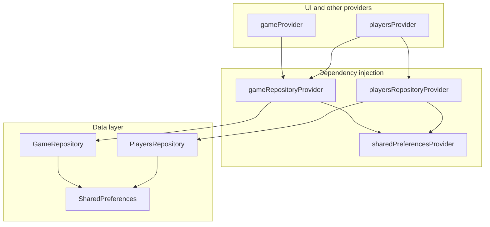

# State Management Documentation

## Retaining and Managing State

The application saves the game configuration when the game is started and the current game state while the game is being played. There is currently a 5-second delay (debounce) for saving the game state to disk to prevent excessive writes.

### Upon Startup

- **No game state to restore**: It loads the persisted game configuration and makes it the active configuration when the game is launched, showing it on the **Splash Screen**.
- **Game state to restore exists**: The active game is loaded, and the application navigates directly to the `score_table_screen`. This enables seamless game resumption after an app crash, a browser reload on the web, or a pause/dehydration event on mobile.

The "New Game" function on the Splash Screen clears out any previous game state whenever a new game is started.

Currently, there is no way to clear the game configuration or game state other than to configure and start a new game.

## Known Issues and Defects

None currently tracked for startup persistence. Player roster state is saved immediately when the user taps **Continue** on the Splash Screen (see [New Game Flow](#new-game-flow-libpresentationsplash_screendart)).

## Data Model

A game is represented by the `Game` class that contains a game `id` (automatically generated as a UUID) and a game `configuration` implemented by the `GameConfiguration` class. The `GameConfiguration` contains the number of players, the maximum number of rounds, the game mode (`Standard`, `Phase 10`, `French Driving`, `Skyjo`), the score filter, the end game score, and the version.

The players and their scores in a game are represented by the `Players` class, which wraps a list of `Player` objects.

Each player is represented by a `Player` object that contains:

- `name`: The player's display name.
- `scores`: A `Scores` object containing individual round scores.
- `phases`: A `Phases` object tracking phase completion status.
- `frenchDrivingAttributes`: A list of `FrenchDrivingRoundAttributes` (for the French Driving game mode).
- `roundStates`: A `RoundStates` object representing per-round information (such as round column locks that tell the UI to block editing for that round).

---

## State Management

This application uses **Riverpod 3** (via `flutter_riverpod` and `hooks_riverpod` version `^3.1.0`) as its state management solution. Riverpod provides compile-time safety, unidirectional data flow, and powerful reactive programming capabilities. The architecture uses `Notifier` and `NotifierProvider` to manage and modify synchronous application state.

### Features Include

- **Separation of Concerns**: Game configuration and player data use separate notifier providers (`gameProvider`, `playersProvider`) and repository providers (`gameRepositoryProvider`, `playersRepositoryProvider`) for persistence.
- **Reactive UI**: The UI widgets automatically watch and rebuild in real-time when the state changes.
- **Persistence**: Game configuration and Player progress are persisted locally using `SharedPreferences`, enabling app restart recovery ("Resume Game").

### Core Concepts

- **Notifier**: A class extending `Notifier<T>` that encapsulates business logic and manages state of type `T`.
- **NotifierProvider**: Declares a provider that exposes and manages a `Notifier` instance.
- **ref.watch()**: Subscribes a widget or another provider to state changes, triggering a rebuild when the state updates.
- **ref.read()**: Reads the current state or triggers actions inside a notifier without subscribing to future updates (typically used in event handlers like buttons).

---

## Persistence Strategy

The application implements a persistence strategy using `SharedPreferences` to handle app restarts and crashes:

1. **Game Configuration**: Saved immediately when a game is created/started.
2. **Player Progress**: Auto-saved with a **5-second debounce** during gameplay to prevent excessive disk writes.
3. **Resume Game**: On startup, if both a valid game configuration and player state exist, the app automatically navigates to the Score Table, bypassing the Splash Screen.
4. **New Game**: Entering the Splash Screen explicitly clears previous player state to ensure a fresh start.

---

## Provider Architecture

The application separates **persistence** (repository providers) from **in-memory application state** (notifier providers). UI and business logic should almost always use the notifier providers (`gameProvider`, `playersProvider`). Repository providers exist to supply wired `GameRepository` / `PlayersRepository` instances for disk access.



### `gameRepositoryProvider` vs `gameProvider`

| | `gameRepositoryProvider` | `gameProvider` |
| -- | -- | -- |
| **Type** | `Provider<GameRepository>` | `NotifierProvider<GameNotifier, Game>` |
| **Location** | `lib/provider/game_provider.dart` | `lib/provider/game_provider.dart` |
| **Layer** | Data access / persistence | Application state |
| **Value exposed** | A `GameRepository` instance | The live `Game` model (configuration + `gameId`) |
| **Stateful?** | No — each method reads or writes prefs | Yes — holds the active game in memory |
| **Reactive?** | Only rebuilds if `sharedPreferencesProvider` changes | Rebuilds watchers when game config or `gameId` changes |
| **Typical use** | Called from `GameNotifier`, router startup, tests | `ref.watch(gameProvider)` in widgets; `ref.read(gameProvider.notifier).newGame(...)` for actions |
| **Persistence** | `loadGame()`, `saveGame()`, `clearGame()` on key `game_state` | Loads via repository in `build()`; saves when `newGame()` runs |

**`gameRepositoryProvider`** constructs a `GameRepository` with the injected `SharedPreferences` instance. It does not represent “the current game”; it is a stateless service for serializing and deserializing game configuration to disk.

**`gameProvider`** is the single source of truth for the active game session. `GameNotifier.build()` calls `repository.loadGame() ?? Game()` to seed state on startup. `newGame()` updates in-memory `state` (generating a new `gameId`) and then persists via `gameRepositoryProvider`.

**Rule of thumb:** Widgets and `playersProvider` use **`gameProvider`**. Use **`gameRepositoryProvider`** only when you need the repository object itself (rare outside `GameNotifier`, splash persistence, router resume checks, and tests).

```dart
// gameRepositoryProvider — DI for persistence
final gameRepositoryProvider = Provider<GameRepository>((ref) {
  final prefs = ref.watch(sharedPreferencesProvider);
  return GameRepository(prefs);
});

// gameProvider — live game state
class GameNotifier extends Notifier<Game> {
  @override
  Game build() {
    final repository = ref.watch(gameRepositoryProvider);
    return repository.loadGame() ?? Game();
  }

  Future<void> newGame({ /* configuration fields */ }) async {
    state = Game(configuration: GameConfiguration(/* ... */));
    await ref.read(gameRepositoryProvider).saveGame(state);
  }
}
final gameProvider = NotifierProvider<GameNotifier, Game>(GameNotifier.new);
```

**State managed by `gameProvider` (`Game`):**

- `gameId`: Unique string identifying the current game session (new UUID on each `newGame()`).
- `configuration`: `GameConfiguration` — `numPlayers`, `maxRounds`, `gameMode`, `scoreFilter`, `endGameScore`, `version`, plus derived helpers (`numPhases`, `allowNegativeScores`, `enablePhases`).

---

### `playersRepositoryProvider` vs `playersProvider`

| | `playersRepositoryProvider` | `playersProvider` |
| -- | -- | -- |
| **Type** | `Provider<PlayersRepository>` | `NotifierProvider<PlayersNotifier, Players>` |
| **Location** | `lib/provider/players_provider.dart` | `lib/provider/players_provider.dart` |
| **Layer** | Data access / persistence | Application state |
| **Value exposed** | A `PlayersRepository` instance | The live `Players` roster (scores, names, phases, locks) |
| **Stateful?** | No — load/save/clear methods only | Yes — mutates roster during play |
| **Reactive?** | Only rebuilds if `sharedPreferencesProvider` changes | Rebuilds when `gameProvider` changes or roster is updated |
| **Typical use** | Splash `clearPlayers()`, immediate save after Continue, debounced saves inside notifier | `ref.watch(playersProvider)` in score table; `ref.read(playersProvider.notifier).updateScore(...)` etc. |
| **Persistence** | `loadPlayers()`, `savePlayers()`, `clearPlayers()` on key `players_state` | Loads in `build()` if data matches game config; debounced save (5s) on edits; flush on dispose if timer active |

**`playersRepositoryProvider`** supplies a `PlayersRepository` backed by the same `SharedPreferences` instance. It has no concept of “current scores”; it only reads and writes JSON for the player roster.

**`playersProvider`** owns the in-memory score sheet. `PlayersNotifier` watches `gameProvider` so a configuration change rebuilds the roster. On `build()`, it calls `repository.loadPlayers()` and returns persisted data only when `playersMatchConfiguration()` confirms player count and round dimensions match the active game. Mutations (`updateScore`, `updatePlayerName`, `resetGame`, etc.) update `state` and schedule a debounced save through `playersRepositoryProvider`.

**Rule of thumb:** Score table UI and gameplay actions use **`playersProvider`**. Use **`playersRepositoryProvider`** for explicit disk operations (clear on splash entry, save baseline roster after Continue, or direct access in tests/router).

```dart
// playersRepositoryProvider — DI for persistence
final playersRepositoryProvider = Provider<PlayersRepository>((ref) {
  final prefs = ref.watch(sharedPreferencesProvider);
  return PlayersRepository(prefs);
});

// playersProvider — live roster state
class PlayersNotifier extends Notifier<Players> {
  @override
  Players build() {
    final game = ref.watch(gameProvider);
    final repository = ref.watch(playersRepositoryProvider);
    final loadedPlayers = repository.loadPlayers();
    if (loadedPlayers != null &&
        playersMatchConfiguration(loadedPlayers, game.configuration)) {
      return loadedPlayers;
    }
    return Players(
      numPlayers: game.configuration.numPlayers,
      maxRounds: game.configuration.maxRounds,
    );
  }
  // updateScore, updatePlayerName, _scheduleSave → repository.savePlayers(state)
}
final playersProvider = NotifierProvider<PlayersNotifier, Players>(PlayersNotifier.new);
```

**State managed by `playersProvider` (`Players`):**

- Player names and per-player metadata.
- Individual round scores, phase completion (Phase 10), French Driving attributes.
- Round enable/disable (column locks).
- Derived total scores for display.

---

## Data Access Layer (Repositories)

Repository **classes** live under `lib/data/`. They are exposed to Riverpod through **`gameRepositoryProvider`** and **`playersRepositoryProvider`** (not used directly as singletons).

### GameRepository

**Location**: `lib/data/game_repository.dart`

- **Responsibility**: Persist `Game` configuration (not the full in-memory `gameId` lifecycle on every load — see `Game.fromJson` / `toJson` in the model).
- **Key Methods**: `loadGame()`, `saveGame()`, `clearGame()`
- **Prefs key**: `game_state`

### PlayersRepository

**Location**: `lib/data/players_repository.dart`

- **Responsibility**: Persist the `Players` roster and all per-player gameplay fields.
- **Key Methods**: `loadPlayers()`, `savePlayers()`, `clearPlayers()`
- **Prefs key**: `players_state`

---

## App Startup & Navigation Flow

The app startup logic handles state restoration and determines the initial screen.

### Startup Sequence (`lib/main.dart`)

1. **Initialize bindings**: `WidgetsFlutterBinding.ensureInitialized()` is executed.
2. **SharedPreferences**: `SharedPreferences.getInstance()` is awaited once before the widget tree mounts.
3. **Container Creation**: A `ProviderContainer` is created with `sharedPreferencesProvider` from `lib/provider/prefs_provider.dart` overridden to that instance.
4. **Run Application**: The app runs within an `UncontrolledProviderScope`. Providers load persisted state declaratively in their `build()` methods when first read.

### Routing Logic (`lib/router/app_router.dart`)

`appRouterProvider` creates a `GoRouter` whose `initialLocation` is computed by `initialLocation(prefs)`. Resume requires both game and players to deserialize successfully and match dimensions via `playersMatchConfiguration()`:

```dart
String initialLocation(SharedPreferences prefs) {
  final game = GameRepository(prefs).loadGame();
  final players = PlayersRepository(prefs).loadPlayers();
  if (game != null &&
      players != null &&
      playersMatchConfiguration(players, game.configuration)) {
    return '/score-table';
  }
  return '/';
}
```

### New Game Flow (`lib/presentation/splash_screen.dart`)

1. Entering the Splash Screen clears previous player data to guarantee a fresh roster on the next start:

    ```dart
    unawaited(ref.read(playersRepositoryProvider).clearPlayers());
    ```

2. User configures game options on the UI (local state seeded from `gameProvider`, which loads any saved configuration).
3. User clicks the **Continue** button:
    - Creates and saves a new game configuration via `ref.read(gameProvider.notifier).newGame(...)`.
    - Materializes the new roster with `ref.read(playersProvider)` and persists it immediately via `playersRepositoryProvider.savePlayers(...)`.
    - Navigates to `/score-table`.

During gameplay, further player mutations are debounced (5 seconds) before writing to disk.

---

## Identified State Management Problems & Architectural Risks

### 1. New Game Startup Redirect Defect — **Resolved**

Previously, an app reload before the first score/name edit routed back to the Splash Screen because only `game_state` was persisted. **Continue** now saves the initial empty roster immediately, so both keys exist and resume works.

### 2. Imperative Startup & Tight Coupling — **Resolved**

Repositories are no longer singletons and no longer call `repositoryDidLoadPrefs()`. `SharedPreferences` is injected via `sharedPreferencesProvider`, and `GameNotifier` / `PlayersNotifier` load synchronously from `GameRepository` / `PlayersRepository` in `build()`.

---

## Key Files Referenced

- `lib/provider/prefs_provider.dart` - SharedPreferences dependency injection
- `lib/provider/game_provider.dart` - Game configuration state and UUID logic
- `lib/provider/players_provider.dart` - Player data state, validations, and auto-save debouncing
- `lib/data/game_repository.dart` - Game configuration persistence using SharedPreferences
- `lib/data/players_repository.dart` - Player state persistence using SharedPreferences
- `lib/main.dart` - App startup and imperative ProviderContainer setup
- `lib/router/app_router.dart` - App router with initial route resume logic
- `lib/presentation/splash_screen.dart` - Game configuration setting UI & new game initialization
